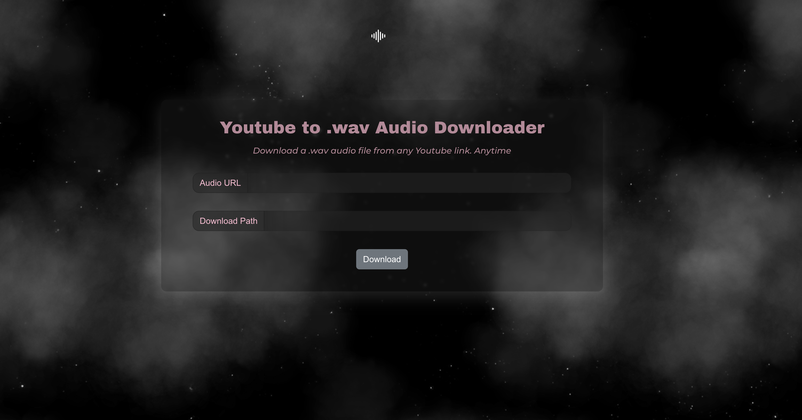

## Purpose
I made this local project for myself to download .wav audio files from YouTube URLs.without all of the spam, ads, and privacy concerns found on current online websites with the same functionality.

### To Run the Frontend
In the project directory, you can run:

1. cd frontend
2. `npm start`

Runs the app in the development mode.\
Open [http://localhost:3000](http://localhost:3000) to view it in your browser.

The page will reload when you make changes.\
You may also see any lint errors in the console.

### To Run the Backend
In the project directory, you can run:

1. cd backend
2. `source myenv/bin/activate`
   - You may have to create a new myenv (virtual environment)
   - You can do so by running : `python3 -m venv myenv`
   - Then proceed with `source myenv/bin/activate`
4. `python3 app.py`
   - If the port you're trying to run the python app on is taken :
   - Navigate to app.py ln. 12 to change the port.
   - Update the POST request in YouTubeToWavDownloader.js ln. 30 to the port chosen above.

### Is it okay to download audio from YouTube?
Here are the rules you need to follow in order to use music from the Library:

- You're not allowed to use the track without giving appropriate credit in the video description.
- Make sure to include the full credits in the video description. ...
- Do not claim the track as your own.
- You're not allowed to sell the track.

Read more here: [https://influencermarketinghub.com/youtube-audio-library/](https://influencermarketinghub.com/youtube-audio-library/)
